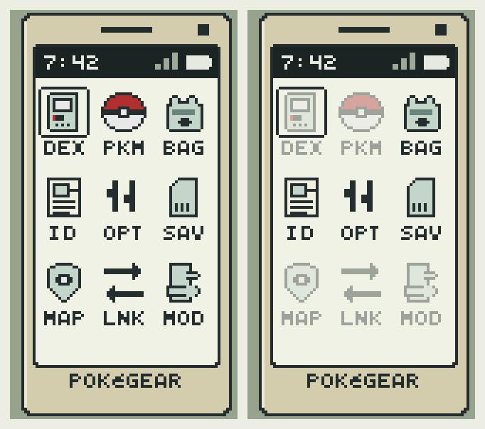

**A START menu overhaul for the [Pokémon Gen 1 Recompilation Project](https://github.com/bryanthaboi/pokemon-gen1-recomp-project).**

A 3x3 grid of apps, drawn in colour over the overworld · runs on Red, Blue, Yellow, Gold, Silver and Crystal · nothing ever moves under your thumb

  
  
  

---

PokéGear Menu replaces the text list you get from START with a handheld device:
a grid of apps, each one always in the same place. An app you have
not earned yet sits dimmed where it will eventually live, so the layout you
learn on your first badge is the layout you still have on your eighth.

   
  Everything unlocked, and a fresh save. A locked app keeps its place rather than collapsing the grid.

## The apps

| | Gen 1 | Gen 2 |
|---|---|---|
| Row 1 | DEX PKM BAG | DEX PKM BAG |
| Row 2 | ID OPT SAV | MAP RAD PHN |
| Row 3 | MAP LNK MOD | ID OPT SAV |
| Page 2 | EXT | MOD EXT |

Three glyphs is what a 21px cell holds, so each caption is abbreviated to fit
under its icon. A status bar across the top of the screen carries a clock, a
battery, and three signal bars that fill while a link session is live.

On Gen 1 this is a reskin of the menu, not the Gen 2 PokéGear. The real
PokéGear had a clock, a map, a radio and a phone; Gen 1 has only the clock and
the map. MAP opens the TOWN MAP and needs you to be carrying it, exactly as
using the item from the bag does.

On Gen 2 it is not a reskin at all. MAP, RADIO and PHONE open the engine's own
PokéGear cards -- the actual town map, the tunable radio, the phone that can
place calls. Each stays dimmed until the cart itself hands that card over: the
Guide Gent for the map, the Radio Tower quiz for the radio, and Mom's call for
the phone. SAVE closes the phone rather than returning to the grid, because
that is what the cart's own save does.

LINK is Gen 1 only. Gen 2 link runs through the engine's own `LinkBattle2`
and the launcher arenas, a path this mod does not drive, so it comes off rather
than shipping as a dead app.

Page one is nine apps on both generations, so anything past that pages: EXT on
Gen 1, MOD then EXT on Gen 2, reached with L and R or by walking off the edge of
the grid. The trainer card has to be on the grid: the START menu is the engine's
only door to it, and this mod replaces the START menu.

## Install

**Mod manager:** grab the release zip from
[Releases](../../releases) and import it -- FIND MODS in the launcher, or drop
the zip into the save directory's `imports/mods/` folder and rescan.

**Manual:** unzip the release into the game's `mods/pokegear_menu/` directory.
It claims the `StartMenu` screen id, so it takes over the START menu with no
further configuration.

## QUIT

EXT on page two, in the pokeball red no other app uses, because it is the one
that does not come back. It asks before it goes, starting on NO, and then
returns you to the title -- the same confirm the built-in menu's own QUIT row
puts up, on both generations.

The Game Boy's own soft reset still works too: hold A, B, SELECT and START
together.

## Permissions

`engine_internals` is for re-running the START menu's own `ui.start_menu.items`
hook and reaching its built-in SAVE flow. `network` is for the LINK app: it
opens the engine's own `src.link.LinkState`, the vanilla peer-to-peer link play
screen, unmodified.

## Try it

    cmd /c mklink /J game\mods\pokegear_menu <path to this repo>
    cd game && python3 tools/modkit.py validate mods/pokegear_menu --base imported
    cd game && python3 tools/modkit.py lint mods/pokegear_menu
    cd game && python3 tools/modkit.py gen2check mods/pokegear_menu
    cd game && luajit mods/pokegear_menu/tests/phone_screen_test.lua
    cd game && luajit mods/pokegear_menu/tests/gen2_apps_test.lua

## Regenerating the art

    python tools/gen_assets.py

Every pixel is declared as text in that script, so the art is original and
carries its own provenance.

## Limits

- The status bar clock reads real-world time, which sits outside the fiction.
  There is no in-game clock on Gen 1 to read instead.
- If another mod adds a row to the START menu, it lands on page two. The phone
  keeps its own nine apps on page one so an app never changes position, which
  overrides where the injecting mod asked its row to sit.
- SAVE borrows the built-in START menu to reach the engine's own save flow, so
  opening it re-runs the `ui.start_menu.items` hook. Another mod's wrapper
  fires once more per save press as a result.
- The phone draws its own 4x6 face for every label it shows, including the app
  captions, the clock and the footer, because the engine font does not fit a
  21px cell.

## Version

Newest release: [releases/latest](https://github.com/Code-Grub/pokegear-menu/releases/latest) -- full history in [CHANGELOG.md](CHANGELOG.md).

## License

MIT -- see [LICENSE](LICENSE). Fork it, bundle it, build on it; just keep the
notice. The mod ships no game assets: the icons and the 4x6 label face are
generated by `tools/gen_assets.py`.
