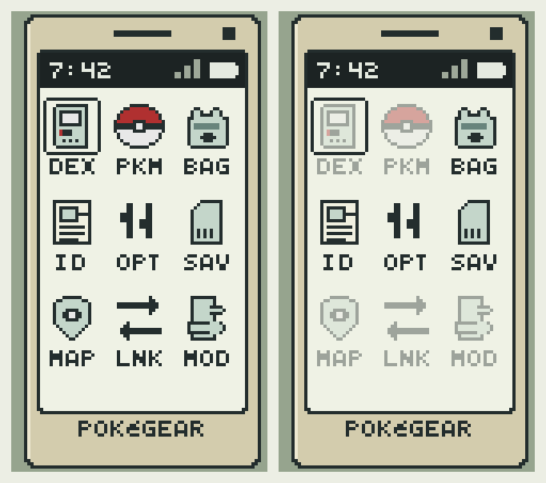

**A new START menu for the [Pokémon Gen 1 Recompilation Project](https://github.com/bryanthaboi/pokemon-gen1-recomp-project).**

Turns START into a handheld device with a grid of apps, drawn in full colour over the world. Works on Red, Blue, Yellow, Gold, Silver and Crystal.

  
  
  

---

Press START and instead of a plain text list, you get a phone: a 3x3 grid
of app icons sitting right over the game world. Every app has a fixed
spot. If you haven't unlocked something yet, it just sits there dimmed
until you do — nothing shuffles around as you play.

   
  Fully unlocked, and a brand new save. Locked apps stay in place instead of disappearing.

## What's on the grid

| | Gen 1 | Gen 2 |
|---|---|---|
| Row 1 | DEX PKM BAG | DEX PKM BAG |
| Row 2 | ID OPT SAV | MAP RAD PHN |
| Row 3 | MAP LNK MOD | ID OPT SAV |
| Page 2 | EXT | MOD EXT |

Everything you'd expect from the START menu is here — your Pokédex, party,
bag, trainer card, options, and save — plus a MODS app for managing other
mods, and EXT to quit. There's a clock and a signal bar up top too, and it
lights up when you're in a link session.

On the older games (Red, Blue, Yellow), MAP and the rest are simple —
MAP just opens the Town Map, the same as using it from your bag. On Gold,
Silver and Crystal, though, MAP, RADIO and PHONE are the real deal: they
open the actual in-game PokéGear, so you get the working map, radio and
phone, unlocked exactly when the story normally gives them to you.

Only nine apps fit on the first page, so anything extra spills onto a
second page — reachable with L and R, or by just walking off the edge of
the grid.

## Give other mods' menu icons a face

If another mod adds its own row to this menu, it normally just shows a
plain "?" icon. You can change that: hold down A on that row (instead of
tapping it) for about a second, and a little picker pops up letting you
pick a sparkle, heart, flag, bolt, shield, moon, gem or leaf instead — or
switch back to the "?" if you change your mind. Your choice is remembered.

A quick tap still opens the row like normal — only a proper hold brings up
the picker, and only mod-added rows can be customized this way.

## Installing it

**Using a mod manager:** grab the zip from
[Releases](../../releases) and import it — either through FIND MODS in the
launcher, or by dropping the zip into your save folder's
`imports/mods/` and rescanning.

**By hand:** unzip the release into your game's `mods/pokegear_menu/`
folder. That's it — it takes over the START menu automatically.

## About EXT (quit)

EXT lives on page two, drawn in red since it's the one option that doesn't
bring you back. It'll ask you to confirm (defaulting to "no") before
sending you back to the title screen — same as the original menu's quit.

The Game Boy's classic soft reset still works too: hold A, B, SELECT and
START together.

## A few things worth knowing

- The clock in the status bar shows real-world time — Gen 1 has no in-game
  clock of its own to pull from instead.
- A row added by another mod always lands on page two, after this mod's
  own nine apps, no matter where that mod tried to place it. Opening it
  and backing out will bring you back to this menu, unless that mod
  specifically asks not to.
- Every letter you see on the phone — app names, the clock, the footer —
  is drawn with this mod's own tiny font, because the game's normal font
  is too big to fit.

## Permissions this mod asks for

- `engine_internals` — needed to keep other mods' menu items working, and
  to reach the game's real save screen.
- `network` — needed for the LINK app, which opens the game's own link
  trade/battle screen.

## For contributors

Run the test suite and validation:

    cmd /c mklink /J game\mods\pokegear_menu <path to this repo>
    cd game && python3 tools/modkit.py validate mods/pokegear_menu --base imported
    cd game && python3 tools/modkit.py lint mods/pokegear_menu
    cd game && python3 tools/modkit.py gen2check mods/pokegear_menu
    cd game && luajit mods/pokegear_menu/tests/phone_screen_test.lua
    cd game && luajit mods/pokegear_menu/tests/gen2_apps_test.lua

Regenerate the icon sheet and font after editing `tools/gen_assets.py`:

    python tools/gen_assets.py

Every pixel in this mod is hand-declared as plain text in that script —
none of the art is pulled from the original game.

## Version

Latest release: [releases/latest](https://github.com/Code-Grub/pokegear-menu/releases/latest) — full history in [CHANGELOG.md](CHANGELOG.md).

## License

MIT — see [LICENSE](LICENSE). Fork it, bundle it, build on it, just keep
the notice. No original game assets are included; the icons and font are
generated by `tools/gen_assets.py`.
